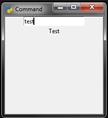

# PyWin

PyWin est un module basé sur tkinter permettant de créer des fenêtres.

Example

- `c:/example/main.py`

```python
from pyWin import App

class App(App):
    def run(self):
        en = self.get_lang("en")
        mainInterface = self.get_interface("main", en)
        window = self.create_window(mainInterface)
        window["command"].focus()

        window.open()
    def command_valid(self, window, widget):
        command = window["command"].get_value()
        window["result"].set("bg", "SystemButtonFace")
        window["result"].set("fg", "black")
        window["command"].clear()
        if command != "":
            if command == "exit":
                window.close()
            elif command == "test":
                window["result"].set_value("Test")
            elif command == "lang":
                window.set_lang()
            elif command.startswith("lang "):
                window.set_lang(self.get_lang(command[5:] or None)) 
            else:
                window["result"].set("bg", "red")
                window["result"].set("fg", "white")
                window["result"].set_value("Command not found")
        else:
            window["result"].clear()
```

- `c:/example/interface/main.yaml`

```yaml
title: $title$
pos: center

widgets:
  - type: entry
    action: valid
    tag: command
  - type: label
    tag: result
```

- `c:/example/lang/fr.yaml`

```yaml
title: Commande
```

- `c:/example/interface/en.yaml`

```yaml
title: Command
```

- Command : `python pyWin.py c:/example`

- Résultat


-


Documentation python

Classes

> App

- Methodes

|Nom|Arguments|Resultat|Description|
|---|---------|--------|-----------|
|get_lang|str name|Lang|Récuère une langue|
|get_interface|str name, [Lang lang]|Interface|Récupère une interface|
|create_window|Interface interface|Window|Crée une fenêtre|
|get_command|str command|func|Retourne une commande ou déclanche une exception CommandNotFoundError si la commande est introuvable|
|get_script|str script|func|Retourne un script ou déclanche une exception ScriptNotFoundError si le script est introuvable|
|error|str message, [str title]|-|Ouvre une fenêtre de dialogue d'erreur|
|info|str message, [str title]|-|Ouvre une fenêtre de dialogue d'information|
|warning|str message, [str title]|-|Ouvre une fenêtre de dialogue d'avertissement|
|yesno|str question, [str title]|bool|Ouvre une fenêtre de dialogue où l'utilisateur peut cliquer sois sur oui sois sur non et retourne le résultat|
|okcancel|str question, [str title]|bool|Ouvre une fenêtre de dialogue où l'utilisateur peut cliquer sois sur ok sois sur annuler et retourne le résultat|
|retrycancel|str question, [str title]|bool|Ouvre une fenêtre de dialogue où l'utilisateur peut cliquer sois sur réessayer sois sur annuler et retourne le résultat|
|yesnocancel|str question, [str title]|bool|Ouvre une fenêtre de dialogue où l'utilisateur peut cliquer sois sur oui sois sur non sois sur annuler et retourne le résultat|

- Attributs

|Nom|Type|Description|
|---|----|-----------|
|path|str|Chemin vers l'application|
|windows|list\<Windows\>|Liste des fenêtres de l'application|
|root|Window/NoneType|Fenêtre principal de l'application ou None s'il n'y en a pas|

> Window

- Methodes

|Nom|Arguments|Resultat|Description|
|---|---------|--------|-----------|
|set_lang|[str name], [func callback]|-|Change la langue de la fenêtre|
|run|[str script]|-|Lance un script (ou le script par default si aucun script est passé en argument)|
|cmd|str command, Widget widget|-|Lance une commande|
|create_widget|str type, [kwargs, ...]|Widget|Crée un widget et le retourne|
|open|-|-|Ouvre la fenêtre|
|close|-|-|Ferme la fenêtre|

- Attributs

|Nom|Type|Description|
|---|----|-----------|
|app|App|Application de la fenêtre|
|interface|Interface|Interface de la fenêtre|
|lang|Lang|Langue de la fenêtre|
|widgets|list\<Widget\>|Widgets de la fenêtre|
|title|str|Titre de la fenêtre|
|size|tuple(int, int)|Taille de la fenêtre|
|pos|tuple(int, int)|Position de la fenêtre|
|icon|str|Chemin de l'icone de la fenêtre|

> Interface

- Methodes

Cette classe n'a pas de methodes

- Attributs

|Nom|Type|Description|
|---|----|-----------|
|path|str|Chemin de l'interface|
|lang|Lang|Langue de la fenêtre|
|title|str|Titre de la fenêtre|
|icon|str|Chemin de l'icon de la fenêtre|
|events|list\<list/str\>|Liste des evenements liés à la fenêtre|
|size|tuple(int, int)|Taille de la fenêtre|
|pos|tuple(int, int)|Position de la fenêtre|
|widgets|list\<MetaWidgets\>|Widgets de la fenêtre|

> Lang

- Methodes

|Nom|Arguments|Resultat|Description|
|---|---------|--------|-----------|
|get|str name|str|Retourne le mot dans la langue|

- Attributs

Cette class n'a pas d'attributs

> Widget

- Methodes

|Nom|Arguments|Resultat|Description|
|---|---------|--------|-----------|
|set|str key, any value|-|Modifie un argument du widget|
|get_value|-|-|Retourne la valeur de la variable du widget (ou None si le widget n'a pas de variable)|
|set_value|str value|-|Modifie la valeur de la variable du widget (s'il à une variable)|
|insert|str text|-|Ajoute du text à la fin de la variable du widget (s'il à une variable)|
|back|[int n]|-|Retire n caractères à la variable du widget (s'il à une variable)|
|clear|-|-|Efface la valeur de la variable du widget (s'il à une variable)|
|delete|-|-|Supprime le widget|
|focus|-|-|Focus le widget en question|
|disable|-|-|Désactive le widget|
|enable|-|-|Active le widget|

- Attributs

|Nom|Type|Description|
|---|----|-----------|
|window|Window|Fenêtre dans laquelle se trouve le widget|
|app|App|Application dans laquelle se trouve le widget|
|id|int|Identifiant du widget|
|type|str|Type de widget|
|args|dict|Aguments du widget|
|var|tkinter.StringVar/NoneType|Variable du widget ou None si le widget n'a pas de variable|
|binds|list\<list/str\>|Liste des evenements liés au widget|
|pos|tuple(str, int/str, \[int\])|Information sur le positionnement du widget|
|tag|str|Tag du widget|

> MetaWidget

- Methodes

Cette classe n'a pas de methodes

- Attributs

|Nom|Type|Description|
|---|----|-----------|
|app|App|Application du MetaWidget|
|type|str|Type du MetaWidget|
|args|dict|Arguments du MetaWidget|

Pour récupéré un widget, donnez lui un tag avec la propriété `tag` des widgets et utilisez la syntax suivante:

```python
widget = window["widgetTag"]
```

Vous pouvez aussi le récupérer avec son id en utilisant la syntax suivante:

```python
widget = window[widgetId]
```

Documentation YAML

|Nom|Format|Obligatoire|Description|
|---|------|-----------|-----------|
|title|\<str\>|Non|Titre de la fenêtre|
|size|"\<int\>, \<int\>"|Non|Taille de la fenêtre|
|pos|"\<int\>, \<int\>"|Non|Position de la fenêtre|
|icon|\<str\>|Non|Icon de la fenêtre|

Autres propriétés

- Events\<list\<list/str\>\>

|Format|Description|
|------|-----------|
|\<str\>|Nom de l'evenement|
|\<str\>|Script à appeller quand l'evenement survient|

ex:

```YAML
events:
  - Return my_script
  - - space
    - my_other_script
```

- Widgets\<list\<dict\>\>

|Nom|Format|Obligatoire|Description|
|---|------|-----------|-----------|
|type|\<str\>|Oui|Type du widget|
|text|\<str\>|Non|Texte du widget|
|pos|"grid \<int\> \<int\>"/"pack \[str\]"/"place \<int\> \<int\>"|Non|Manière dont le widget doit être positionné|
|tag|\<str\>|Non|Tag du widget|
|disabled|\<bool\>|Non|S'il est à true le widget est grisé et devient inactif|
|action|\<str\>|Non|Action liée au widget|

Autres propriétés d'un widget

- Events\<list\<list/str\>\>

|Format|Description|
|------|-----------|
|\<str\>|Nom de l'evenement|
|\<str\>|Commande à appeller quand l'evenement survient|

ex:

```YAML
widgets:
  - type: text
    events:
      - - Return
        - my_command
      - space my_other_command
```
